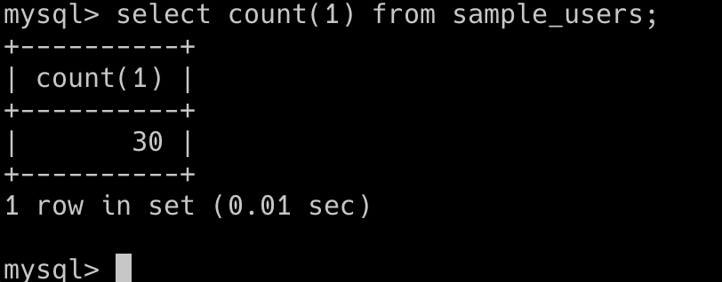
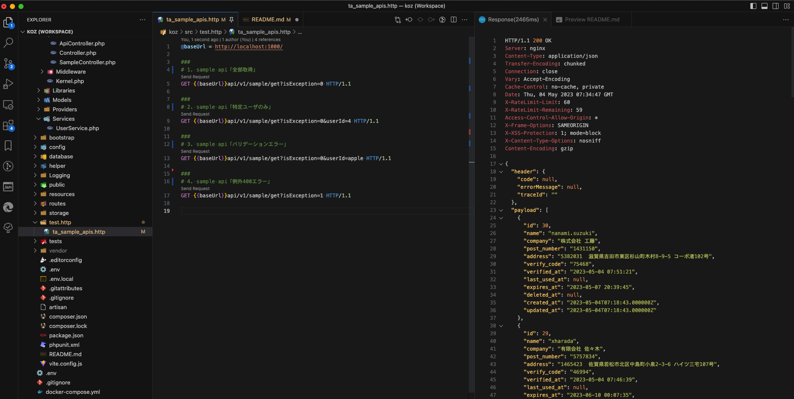
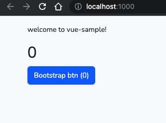

# vue-sample

**ver:**
| language   | version |
| ---------- | ------- |
| php        | 8.2     |
| Laravel    | 10.9    |
| mysql      | 5.7     |
| vue        | 3.2     |
| typescript | 5.0     |


## 1. 事前準備

### 必須インストール
動作・開発に影響があるため、必ずインストールが必要
1. [Docker](https://www.docker.com/products/docker-desktop/)
2. [VScode](https://code.visualstudio.com/download)
3. [nodejs](https://nodejs.org/ja/download) - 推奨版をインストール(ver 18.x)
4. [REST Client](https://marketplace.visualstudio.com/items?itemName=humao.rest-client)
5. [PHP Debug](https://marketplace.visualstudio.com/items?itemName=xdebug.php-debug)
6. [TypeScript Vue Plugin (Volar)](https://marketplace.visualstudio.com/items?itemName=vue.vscode-typescript-vue-plugin)

### おすすめインストール
動作・開発に影響はないですが、インストールしたふがいい
1. [CodeSpellChecker](https://marketplace.visualstudio.com/items?itemName=streetsidesoftware.code-spell-checker)
2. [PHP Sniffer & Beautifier](https://marketplace.visualstudio.com/items?itemName=ValeryanM.vscode-phpsab)

## 2. プロジェクト初期設定
**用語:**
- {WorkDir} = プロジェクトをクーロンしたルートディレクトリ
- BE = Back End
- FE = Front End

**2.1 DOCKERビルド:**
```bash
$cd {WorkDir}
$docker-compose up
```
**2.2 laravel package install:**
```bash
$cd {WorkDir}
$docker-compose exec php composer install
```

**2.3 migration実施:**
```bash
$cd {WorkDir}
$docker-compose exec php php artisan migrate
```

**2.4 SEED投入:**
```bash
$cd {WorkDir}
$docker-compose exec php php artisan db:seed
```

**2.5 FEパッケージインストール:**
```bash
$cd {WorkDir}\src
$npm install
```
## 3. 動作確認
**3-1 DB:**

好みのDBクライアントツールを利用し、下記のように「sample_users TABLE」データ(30件)が生成されているか確認

[DBアクセス情報リンク](https://github.com/yasuo-kozuka/vue-php/blob/main/.env)
```bash
# mysql コマンド利用してアクセスした例
$cd {WorkDir}
$mysql -uvue-sample -pvue-sample -P 33068 -D vue-sample-db --protocol TCP
```



**3-2 BE API:**
1. 下記画面のように「ta_sample_apis.http」開き「1. sample api「全部取得」APIを実行
2. 下記画像の右側のように200レスポンスされたらオッケー（データはFAKERを利用したダミーデータのため、環境ごと違う）


**3-3 画面:**
1. 以下のコマンドでFEビルド
```bash
$cd {WorkDir}/src
$npm run dev
```
1. ブラウザにてhttp://localhost:1000/ にアクセスし、下記のような画面が表示されるのを確認




## 4. その他

**4.1 ログ:**

**周期：**

　日にち毎14日分保存保存している

**保存場所：**

　*{workDir}/src/storage/logs/koz-vue-sample-yyyy-mm-dd.log*

**フォーマット:**
```bash
{
 "DateTime": "{ログ記録されたサーバー日付(マイグロ秒まで)}",
 "LogLevel": "{DEBUG |INFO|DEBUG}のうどちらか",
 "HttpMethod": "{POST|GET|DELETE|PUT}などリクエストされたメソッド",
 "URL": "{リクエストされたAPIパス}",
 "PID": "{処理開始から終了までユニークなUID}",
 "FIleName": "{発生したファイル名}",
 "FileLine": {発生したファイルの行},
 "Summary": "{message.phpに定義した内容|LARAVEL(PHP)側で出力される内容}",
 # ログ出力する際に一緒に出力したパラメータ等(ta_sample_apis.httpファイル参照)
 "Message": {
    "parameter_a": null,
    "before_status": 2,
    "after_status": 2,
  },
  # 一般的なPHP TRACE
  "Trace": "NO-SET-TRACE"
}
```