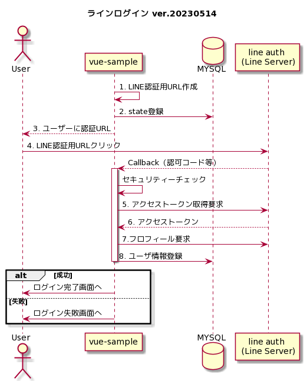

# ラインログイン調査
調査の結果、全体図がイメージ化できており、調査内容をまとめたものです。
本ドキュメントをベースに一度報告及び要件のヒアリングさせて頂ければと思っております。
## シーケンス図

## 相談内容
1. 要件においてユーザメアド取得する必要あるか、理由:「[メールアドレスの取得権限を申請](https://developers.line.biz/ja/docs/line-login/integrate-line-login/#create-a-channel)」が必要のため。
2. 要件としては「LINEログイン」のみなのか。独自ログインも考えているか。

## 取得できるもの
但し認可画面にユーザが許可しないと取れない
- ユーザID(userId)
- ユーザ表示名(displayName)
- ユーザ画像URL(pictureUrl)
- ユーザメール（※別当申請が必要）
## 事前準備
現時点はヨン個人でDEVELOP登録しています。
### チャネル作成
[LINE Developersコンソール](https://developers.line.biz/console/channel/new?type=line-login)でラインログインチャネルを作成。

### 補足
**登録際に:**
1. CallbackUrlは「 http://localhost:1000/api/v1/callback/line 」に登録(ローカル環境)

**登録が完了したら:**

下記の情報をメモ
1. チャネルID(ex:1661062630)
2. チャネルシークレット(ex: 01b396f6c8db95165398c536bdb2c4fb)

## A.流れ
### 1. ユーザーに認証と認可を要求
**sample request:**
```
https://access.line.me/oauth2/v2.1/authorize?response_type=code&client_id=1661062630&redirect_uri=http%3A%2F%2Flocalhost%3A1000%2Fapi%2Fv1%2Fcallback%2Fline%3FtestVal%3Dapple&state=12345abcde&scope=profile%20openid%20email&nonce=09876xyz
```
**リクエスト項目(必須のみ):**

| param         | description             |
| ------------- | ----------------------- |
| response_type | code                    |
| redirect_uri  | 作成したコールバックURL |
| state         | 英数字の文字列          |
| scope         | profile%20openid        |

**正常 レスポンス項目(必須のみ):**
| param | description                          |
| ----- | ------------------------------------ |
| code  | 認可コード・有効期間は10分・一回のみ |
| state | リクエストの際のstate                |

**異常 レスポンス項目(必須のみ):**
| param | description           |
| ----- | --------------------- |
| error | エラーコード          |
| state | リクエストの際のstate |
### 2. アクセストークンを取得する
上記「A.1」で取得した認可コードを利用
**リクエスト項目(必須のみ):**
| param         | description             |
| ------------- | ----------------------- |
| grant_type    | authorization_code      |
| code          | 受け取った認可コード    |
| redirect_uri  | 指定したコールバックURL |
| client_id     | チャンネルID            |
| client_secret | チャネルシークレット    |

**正常 レスポンス項目(必須のみ):**
| param         | description    |
| ------------- | -------------- |
| access_token  | 有効期間は30日 |
| expires_in    | 有効期間(秒)   |
| refresh_token | 有効期間は90日 |
| scope         | -              |
| token_type    | Bearer         |
### 3. ユーザープロフィールを取得 [link](https://developers.line.biz/ja/reference/line-login/#get-user-profile)
上記「A.2」で取得した[access_token]を利用

**リクエスト項目(必須のみ):**
| param        | description        |
| ------------ | ------------------ |
| access_token | リクエストヘッダー |

**正常 レスポンス項目:**
| param         | description            |
| ------------- | ---------------------- |
| userId        | ユーザID               |
| displayName   | 表示名                 |
| pictureUrl    | 指定されている場合のみ |
| statusMessage | 設定されている場合のみ |

### 4. その他
下記は要件によるものであり、省略
1. 友どち関係API
2. アクセストークン更新API
3. アクセストークン無効API
4. IDトークンからプロフィール情報を取得

## ドキュメント
[LINE Developers](https://developers.line.biz/ja/docs/line-login/getting-started/#step-1-create-channel)

## 参考になる情報
- [ウェブアプリにLINEログインを組み込む](https://developers.line.biz/ja/docs/line-login/integrate-line-login/)
- [LINEログイン v2.1 APIリファレンス](https://developers.line.biz/ja/reference/line-login/#status-codes)
- [LINE Login 超入門](https://qiita.com/nkjm/items/c8eac296dfee14fe5cf7)
